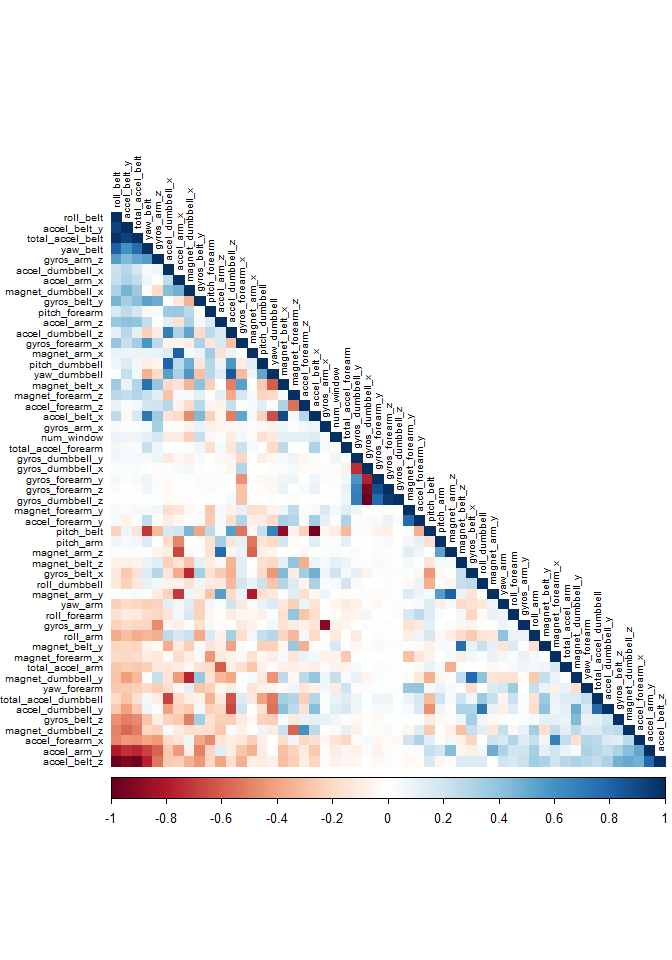

### Overview

The project's goal is to use data from accelerometers on the belt, forearm, arm, and dumbell of 6 participants to predict the manner in which they did the exercise. This is the "classe" variable in the training set. The selected prediction model will be used to predict 20 different test cases.


### Loading packages and Datasets


```r
# read packages
library(tidyverse)
library(caret)
library(rpart)
library(rpart.plot)
library(rattle)
library(randomForest)
library(corrplot)
set.seed(15024)


# read the datasets
df_train <-  read_csv("pml-training.csv") %>% 
  rename(X1 = `...1`)

df_test <- read_csv("pml-testing.csv") %>% 
  rename(X1 = `...1`)
```


### Data partitioning step

Because we want to estimate the _out-of-sample error_, we split the full dataset(df_train) into a training set (trainset) and a validation set (testset)


```r
# split data to create trainset and testset
inTrain  <- createDataPartition(df_train$classe, p=0.7, list=FALSE) %>%
  as.data.frame() %>% rename(X1 = Resample1)

trainset <- semi_join(df_train, inTrain)
testset <- anti_join(df_train, inTrain)
```

### Data cleaning step

* Let us remove variables with near Zero variance (NZV)
* Let us delete predictors containing missing values
* Let us remove useless variables


```r
NZV <- nearZeroVar(trainset)

trainset <-  trainset %>%
  select(-NZV) %>%
  select(which(colMeans(is.na(.)) == 0),
         -(1:5))

testset <- testset %>% 
  select(-NZV) %>%
  select(which(colMeans(is.na(.)) == 0),
         -(1:5))
```


Each dataset is remaining with 54 variables

#### Correlation

Let us visualize correlation among predictors left in our dataset


```r
corMatrix <- cor(trainset[, -54])
corrplot(corMatrix, order = "FPC", method = "color", type = "lower",
         tl.cex = 0.6, tl.col = rgb(0, 0, 0))
```




---

### Modeling

Let us try to fit the following ML models to our data and see which one performs better.

* Decision Trees
* Random Forest
* Generalized Boosted Model

---

#### Decision Trees


```r
# fitting the model
set.seed(15024)
DTree_ModFit <- rpart(classe ~ ., data=trainset, method="class")

# prediction 
DTree_predict <- predict(DTree_ModFit, newdata=testset %>% mutate(classe=as.factor(classe)), type="class")
DTree_ConfMat <- confusionMatrix(DTree_predict, as.factor(testset$classe))
DTree_ConfMat
```

```
## Confusion Matrix and Statistics
## 
##           Reference
## Prediction    A    B    C    D    E
##          A 1470  108    0   14    5
##          B   97  841   76   81   57
##          C    0   57  854   28    4
##          D   96   76   92  788  186
##          E   11   57    4   53  830
## 
## Overall Statistics
##                                           
##                Accuracy : 0.8127          
##                  95% CI : (0.8025, 0.8226)
##     No Information Rate : 0.2845          
##     P-Value [Acc > NIR] : < 2.2e-16       
##                                           
##                   Kappa : 0.7638          
##                                           
##  Mcnemar's Test P-Value : NA              
## 
## Statistics by Class:
## 
##                      Class: A Class: B Class: C Class: D Class: E
## Sensitivity            0.8781   0.7384   0.8324   0.8174   0.7671
## Specificity            0.9698   0.9345   0.9817   0.9086   0.9740
## Pos Pred Value         0.9205   0.7300   0.9056   0.6365   0.8691
## Neg Pred Value         0.9524   0.9370   0.9652   0.9621   0.9489
## Prevalence             0.2845   0.1935   0.1743   0.1638   0.1839
## Detection Rate         0.2498   0.1429   0.1451   0.1339   0.1410
## Detection Prevalence   0.2714   0.1958   0.1602   0.2104   0.1623
## Balanced Accuracy      0.9240   0.8364   0.9070   0.8630   0.8705
```

From decision trees method, we have **Accuracy: 0.8127**

---

#### Random Forest

Let us try a Random Forest model and see how it performs using a 3-fold cross-validation.


```r
set.seed(15024)
# Model fitting
RF_control <- trainControl(method="cv", 3)
RF_model <- train(classe ~ ., data=trainset, method="rf", trControl=RF_control, ntree=200)
RF_model$finalModel
```

```
## 
## Call:
##  randomForest(x = x, y = y, ntree = 200, mtry = param$mtry) 
##                Type of random forest: classification
##                      Number of trees: 200
## No. of variables tried at each split: 27
## 
##         OOB estimate of  error rate: 0.25%
## Confusion matrix:
##      A    B    C    D    E  class.error
## A 3905    0    0    0    1 0.0002560164
## B    7 2649    1    1    0 0.0033860045
## C    0    6 2389    1    0 0.0029215359
## D    0    0    9 2243    0 0.0039964476
## E    0    0    0    8 2517 0.0031683168
```

```r
# Prediction 
RF_predict <- predict(RF_model, newdata=testset %>% mutate(classe=as.factor(classe)))
RF_confMatrix <- confusionMatrix(RF_predict, as.factor(testset$classe))
RF_confMatrix
```

```
## Confusion Matrix and Statistics
## 
##           Reference
## Prediction    A    B    C    D    E
##          A 1674    6    0    0    0
##          B    0 1132    2    0    0
##          C    0    1 1024    2    0
##          D    0    0    0  962    3
##          E    0    0    0    0 1079
## 
## Overall Statistics
##                                          
##                Accuracy : 0.9976         
##                  95% CI : (0.996, 0.9987)
##     No Information Rate : 0.2845         
##     P-Value [Acc > NIR] : < 2.2e-16      
##                                          
##                   Kappa : 0.997          
##                                          
##  Mcnemar's Test P-Value : NA             
## 
## Statistics by Class:
## 
##                      Class: A Class: B Class: C Class: D Class: E
## Sensitivity            1.0000   0.9939   0.9981   0.9979   0.9972
## Specificity            0.9986   0.9996   0.9994   0.9994   1.0000
## Pos Pred Value         0.9964   0.9982   0.9971   0.9969   1.0000
## Neg Pred Value         1.0000   0.9985   0.9996   0.9996   0.9994
## Prevalence             0.2845   0.1935   0.1743   0.1638   0.1839
## Detection Rate         0.2845   0.1924   0.1740   0.1635   0.1833
## Detection Prevalence   0.2855   0.1927   0.1745   0.1640   0.1833
## Balanced Accuracy      0.9993   0.9967   0.9987   0.9987   0.9986
```

From Random Forest method, we have **Accuracy: 0.9976**

---

#### Generalized Boosted Model

Let us try a Generalized Boosted Model. 


```r
set.seed(15024)

# model fitting
GBM_control <- trainControl(method = "repeatedcv", number = 5, repeats = 1)
GBM_modFit  <- train(classe ~ ., data=trainset, method = "gbm",
                    trControl = GBM_control, verbose = FALSE)
GBM_modFit$finalModel
```

```
## A gradient boosted model with multinomial loss function.
## 150 iterations were performed.
## There were 53 predictors of which 53 had non-zero influence.
```

```r
# prediction 
predictGBM <- predict(GBM_modFit, newdata=testset %>% mutate(classe=as.factor(classe)))
confMatGBM <- confusionMatrix(predictGBM, as.factor(testset$classe))
confMatGBM
```

```
## Confusion Matrix and Statistics
## 
##           Reference
## Prediction    A    B    C    D    E
##          A 1668   15    0    0    0
##          B    5 1110   14    3    7
##          C    0   11 1010   11    4
##          D    1    1    2  950   13
##          E    0    2    0    0 1058
## 
## Overall Statistics
##                                           
##                Accuracy : 0.9849          
##                  95% CI : (0.9814, 0.9878)
##     No Information Rate : 0.2845          
##     P-Value [Acc > NIR] : < 2.2e-16       
##                                           
##                   Kappa : 0.9809          
##                                           
##  Mcnemar's Test P-Value : NA              
## 
## Statistics by Class:
## 
##                      Class: A Class: B Class: C Class: D Class: E
## Sensitivity            0.9964   0.9745   0.9844   0.9855   0.9778
## Specificity            0.9964   0.9939   0.9946   0.9965   0.9996
## Pos Pred Value         0.9911   0.9745   0.9749   0.9824   0.9981
## Neg Pred Value         0.9986   0.9939   0.9967   0.9972   0.9950
## Prevalence             0.2845   0.1935   0.1743   0.1638   0.1839
## Detection Rate         0.2834   0.1886   0.1716   0.1614   0.1798
## Detection Prevalence   0.2860   0.1935   0.1760   0.1643   0.1801
## Balanced Accuracy      0.9964   0.9842   0.9895   0.9910   0.9887
```

From GB model, we have **Accuracy: 0.9849**

---

### Selected Model and test data

Based on performance of the three models, Random Forest model performed batter than the rest in terms of accuracy.
We use Random Forest model to predict the 20 quiz results (test dataset).


```r
QuizResults <- predict(RF_model, newdata=df_test)
QuizResults
```

```
##  [1] B A B A A E D B A A B C B A E E A B B B
## Levels: A B C D E
```
